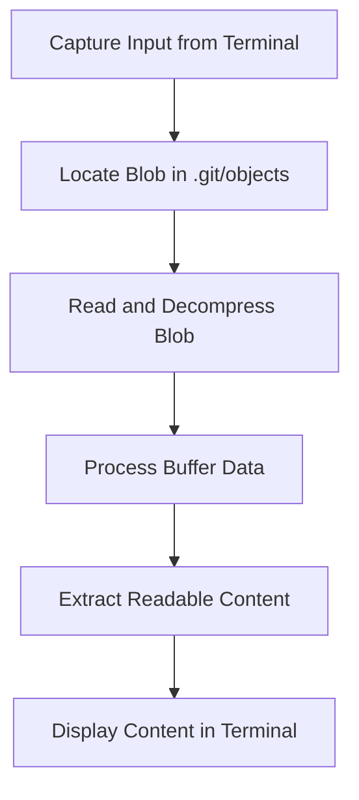

### Flowchart: Reading a Blob Object

Below is a flowchart that explains the process of reading a blob object in Git:



---

### Prerequisite Knowledge

The `git cat-file -p <blob-hash>` command allows you to inspect the content of a blob object in Git. It is a useful tool for understanding how Git stores and retrieves data.

### Example:

```bash
git cat-file -p <blob-hash>
```

- **`git cat-file`**: A plumbing command used to examine Git objects.
- **`-p` flag**: Outputs the content of the object in a human-readable format.
- **`<blob-hash>`**: The unique identifier (SHA-1 hash) of the blob object you want to inspect.

This command is particularly helpful when you want to verify the content of a blob object stored in the `.git/objects` directory.

### Examining the Content:

To view the content of the created object, use the `git cat-file` command:

```bash
git cat-file -p <blob-hash>
```

- **`git cat-file`**: Displays information about Git objects.
- **`-p` flag**: Outputs the content of the object in a human-readable format.

---

### Challenge: Reading a Blob Object

#### Thought Process:

1. Capture the data written to the terminal.
2. Decompress the file using `zlib`.
3. Convert the decompressed data into text using UTF-8 encoding.
4. Locate the folder where the blob object resides.
5. Retrieve the buffer and convert it into a string.
6. The buffer (e.g., `blob\012 helloworld`) needs to be processed to extract readable text.
7. Finally, display the original content typed on the terminal.

---

### Learnings:

1. **`indexOf(0)`**: Learned how to use this method to locate the null value in a buffer.
2. **Buffer**: A buffer is essentially a collection of hexadecimal bytes (e.g., `<Buffer 62 6c 6f 62 20 31 32 00 68 65 6c 6c 6f 20 77 6f 72 6c 64 0a>`).
3. **Null Value Index**: Using `indexOf(0)` on a buffer helps identify the position of the null value.
4. **`subarray` Method**: This method is used to separate the null value and the output text from the buffer, enabling the extraction of readable content.
5. The `process.stdin.on` method listens to your standard input, while `process.argv` captures the arguments you pass in the terminal as an array. This allows you to access and process the exact commands or inputs you type in the terminal.

6. Writing clean and well-structured code with clearly defined interfaces is essential. While testing and debugging during development help you grasp functionality, production code requires greater precision. Address edge cases carefully, define types explicitly for your interfaces, and ensure your code is intuitive and maintainable for others.

> **Pro Tip**: If you're unsure about the type to assign, it’s a sign that you need to deepen your understanding of what your code is doing.
