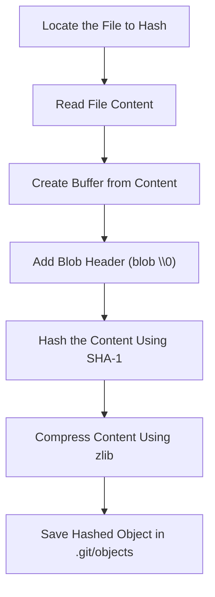

### Flowchart: Creating a Hashed Object

Below is a flowchart that explains the process of creating a hashed object in Git:



---

### Prerequisite Knowledge

The `git hash-object` command is a low-level (plumbing) command in Git. It processes data, stores it in the `.git/objects` directory, and generates a unique identifier (typically a SHA-1 hash) for the object.

Git does not stores a raw file instead it stores it in a blob oject whose strcture is:
blob <size>\0<content>
blob - type of object
size - file size in byte length
0 - null seperator
content - actual file data

### Example:

```bash
echo "hello world" | git hash-object -w --stdin
```

- **`git hash-object`**: Computes a SHA-1 hash (unique identifier) and creates a Git object.
- **`-w` flag**: Ensures the content is written to the `.git/objects` directory as a blob object.
- **`--stdin`**: Accepts input directly from the standard input. In this example, the string `hello world` is piped as input.

### Fun CLI Commands to Explore

- `echo "some text" > "file name"`: Creates a file named `file name` and writes `some text` into it.
- `echo "some new text" >> "file name"`: Appends `some new text` to the existing content of the file.
- `cat > "file name"`: Opens an interactive terminal session for input. The typed content is saved to the file upon exiting (e.g., by pressing `Ctrl+D`).

### Challenge: Creating a Hashed Object

**Steps:**

1. Locate the file you want to hash.
2. Read its contents.
3. Convert the raw text into a buffer for secure handling.
4. Create the buffer header using `Buffer.from('blob <fileSize>\0')`.
   - Concatenate this header with the raw file content.
   - Hash the combined result using SHA-1, outputting a hex string.
   - Compress the raw file using zlib.
5. Save the hashed content in the `.git/objects` directory, using the correct filename.
6. Use `fs.readFileSync` to read files and `fs.mkdir` to create directories as needed.

**Learnings:**

- You can generate a hash using crypto commands like `crypto.createHash(<hash format>)`.
- To get the hash as a SHA-1 string, use `.digest('hex')`.
- When creating a buffer header, avoid concatenating strings like `'blob <fileSize>\0' + content'`—this will cause errors due to stringification.
- Instead, use `Buffer.from()` to create the header and `Buffer.concat()` to combine buffers properly.
